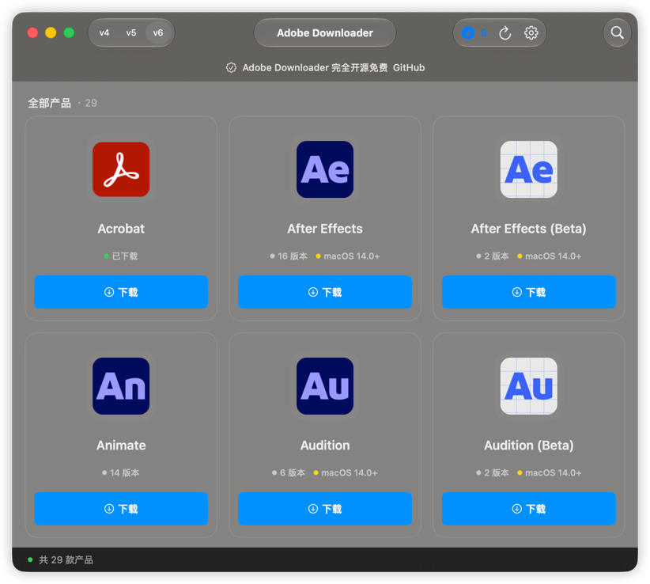

# Adobe Downloader

> All Adobe apps in Adobe Downloader are from official Adobe channels and are not cracked versions.

<a href="https://star-history.com/#X1a0He/Adobe-Downloader&Timeline">
 <picture>
   <source media="(prefers-color-scheme: dark)" srcset="https://api.star-history.com/svg?repos=X1a0He/Adobe-Downloader&type=Timeline&theme=dark" />
   <source media="(prefers-color-scheme: light)" srcset="https://api.star-history.com/svg?repos=X1a0He/Adobe-Downloader&type=Timeline" />
   
 </picture>
</a>

# **[中文版本](readme.md)**

## Before Use

**⚠️ Only supports macOS 13.0+**

> **If you like Adobe Downloader, or if it helps you, please Star the repository 🌟. Your support is what keeps me updating it.**

## 📔 Latest Log

### 2026-06-13 v3.0.0 Update Log

#### Added

- Brand-new download mechanism
  Adobe Downloader further improves its download mechanism and now supports downloading add-ons separately, allowing users to download the main product or specific add-ons more flexibly.

- Brand-new product installation mechanism
  This version removes the dependency on the original Setup component and switches to a new installation engine. It supports full installation and incremental installation for all products, and adds the ability to install add-ons separately.

- Brand-new product uninstallation mechanism
  Add-on uninstallation is now supported. You can uninstall specific add-ons of a product without affecting the complete product itself.

- Adobe Creative Cloud recognition support
  Thanks to the new product installation mechanism, all products installed through Adobe Downloader can now be displayed correctly in Adobe Creative Cloud, including related dependencies.

#### Improvements

- macOS 27 support
  Adobe Downloader has been adapted for macOS 27, improving compatibility and the overall experience on the new system.

- Liquid Glass style support
  The UI has been further upgraded with richer visual presentation, bringing a more modern and refined interaction experience.

#### Others

- This version also includes more new features and experience improvements for Adobe Downloader 3.0, waiting for you to explore.

#### More

- For more app update logs, please check [Update Log](update-log.md)

### Language Support

- [x] Chinese
- [x] English

## ⚠️ Warning

**If you have any optimization suggestions or questions about Adobe Downloader, please open an issue or contact [@X1a0He](https://t.me/X1a0He_bot) via Telegram.**

## ✨ Features

- [x] Basic features 📦
    - [x] Download and install all Adobe apps
    - [x] Support downloading multiple products at the same time
    - [x] Support using the default language and default directory
    - [x] Support task record persistence
- [x] Installation features 📦
- [x] Cleanup features 🧹 (added in 1.5.0)
    - [x] Adobe applications
    - [x] Adobe Creative Cloud
    - [x] Adobe Preferences
    - [x] Adobe Cache files
    - [x] Adobe License files
    - [x] Adobe Log files
    - [x] Adobe Services
    - [x] Adobe Keychain
    - [x] Adobe Genuine Service
    - [x] Adobe Hosts

## 👀 Preview

## 👨🏻‍💻Author

Adobe Downloader © X1a0He

Released under GPLv3. Created on 2024.11.05.

> GitHub [@X1a0He](https://github.com/X1a0He/) \
> Telegram [@X1a0He](https://t.me/X1a0He_bot)
